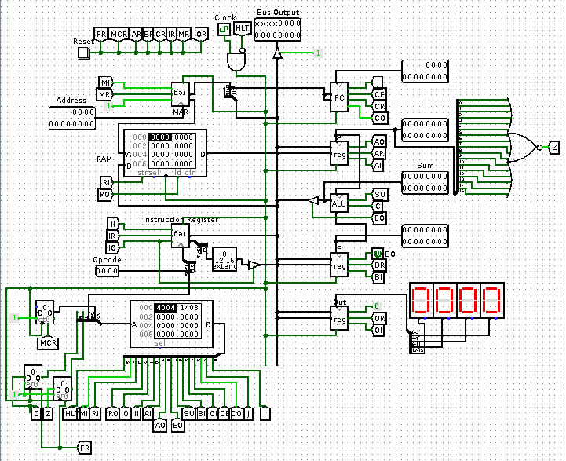

  
<h1 align="center"> Simple RISC Machine </h1>    
    
SRM is a Turing complete 16-bit RISC CPU based on the Von Neumann architecture. It is inspired by the SAP processor by Albert Paul Malvino and Ben Eater's <a href="https://eater.net/8bit">8-bit computer</a>. It is created using <a href="http://www.cburch.com/logisim/">Logisim</a>.  
    
<p align="center">    
        
</p>    
    
### Architecture    
 SRM has a clean and simple architecture. A 16-bit bus runs through the center and connects all the components to each other.   
* Registers  
   * A register - accumulator  
   * B register - internal register for calculations  
   * Out - output register connected to a hex display  
   * Memory Address Register (MAR) - holds the memory location of data that needs to be accessed   
   * Instruction Register (IR) - holds the current instruction that is being executed  
* ALU - capable of doing addition and subtraction  
* CU - created using Microcode ROM   
  
### Control word  

|15|14|13|12|11|10|9|8|7|6|5|4|3|2|1|0|  
|--|--|--|--|--|--|--|--|--|--|--|--|--|--|--|--|  
|HLT|MI|RI|RO|IO|II|AI|AO|EO|SU|BI|OI|CE|CO|J|-|  
  
Detailed description is available in the [microcodes.py](scripts/microcodes.py) file.  
  
### Flags  

|#|Abbreviation|Description|  
|--|--|--|  
|0|C|Carry Flag|  
|1|Z|Zero Flag|  
  
### Microcodes  
The ROM has 9 address lines which map to a data space of 64 bytes. The address lines are:  

|Bits|Input|  
|--|--|  
|A0-A3|microcode counter|  
|A4-A6|instruction decoder|  
|A7|zero bit|  
|A8|carry bit|  
  
### Instruction Set  
  
SRM supports three types of instructions:  
  
 1. `opcode (4-bit) address (12-bit)`  
 2. `opcode (4-bit) data (12-bit)`  
 3. `opcode (4-bit)`  
  
|Opcode|Instruction|Action|  
|--|--|--|  
| 0 | NOP | - |  
| 1 | LDA address | A <- RAM[address] |  
| 2 | ADD address | A <- A + RAM[address] |  
| 3 | SUB address | A <- A - RAM[address] |  
| 4 | STA address | RAM[address] <- A |  
| 5 | LDI data | A <- data |  
| 6 | JMP address | PC <- address |  
| 7 | JZ address | PC <- address if Z |  
| 8 | JC address | PC <- address if C |  
| 14 | OUT | OUT <- A |  
| 15 | HLT | Halts CPU |  
  
### Running programs  
Programs can be written in SRM's assembly and can be assembled using [assembler.py](scripts/assembler.py).
Example, [countdown](codes/countdown):
```asm
; countdown
LDI 1
STA 20
LDI 10
OUT
SUB 20
JZ 7
JMP 3
HLT
```
The above program counts from 10 to 0 and outputs to the out register.

The assembled code can be then loaded in RAM and executed using the logisim interface. 
  
### Future work  
* Cycle optimisation for instructions
